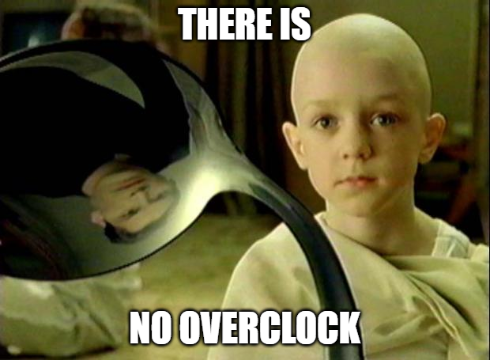

# surviv.io Timers

This guide explains how to underclock ("overclock") in surviv.io.

## Table of Contents
* [Instructions](#instructions) (how to underclock)
  * [Advanced](#advanced) (advanced instructions with more math)
* [Notation](#notation) (how to understand [#instructions](#instructions))
* [Timers](#timers) (why underclock works)
  * [Corollaries](#corollaries) (useful inferences about the new timer system)
  * [Pseudocode](#pseudocode)
  * [Formal Math](#formal-math)
* [Glossary](#glossary) (some useful keywords)
* [Credits](#credits) (nobody cares)
* [Videos](#videos) (watch [#instructions](#instructions) in action)
* [No Overclock](#no-overclock) ("There is no overclock!")

Other pages
* [Data Tables](data-tables.md) (switch delays and deploy groups of all weapons)
* [Old Guide](2020-04-20-old-guide-stark.md) by Stark

## Instructions
### Experimental
These timings work well even with network latency, as long as jitter is low.

#### Double-shot primary
`A 875: ! c 1050: A 1300: ! c`

#### Melee overclock
impossible, so don't bother

#### Grenade quickswitch/overclock (nade spam)
repeat `d ! c` once per throwable

### Theoretical
#### Double-shot primary over 250ms
`999 gun1 251 gun2`  
`A 999: ! c 1000: A 1250: ! c`  
999 can be increased as long as it remains less than 1000, which makes the 250ms possible as a limit

#### Double-shot primary then secondary
`A 999: ! c 1000: B 1250: ! c`  
similar for shooting gun2 then gun 1, and for gun2 twice

#### Shoot M870 3 times over 1250ms, first shot immediately
`m870 900 m870 100 fs 250 m870`  
`! c a 900: ! c 1000: A 1250: !`

#### Shoot SPAS-12 3 times over 1250ms, first shot immediately
`spas 750 spas 250 fs 250 spas`  
`! c a 750: ! c 1000: A 1250: !`

#### Shoot M870 3 times over 1150ms
`999 M8 1 fs 250 M8 900 M8`  
`A 999: ! c 1000: A 1250: ! d a 2150: !`

#### Shoot SPAS-12 3 times over 1000ms
`999 SPAS 1 fs 250 SPAS 750 SPAS`  
`A 999: ! c 1000: A 1250: ! d a 2000: !`

#### Triple shot with MP220+M870 (aka MP220+M870 desync)
`mp220 250 m870 300 mp220`  
`! B 250: ! a 550: !`  
`A 1000: ! B 1250: ! a 1550: !`

#### Common Mistakes for Double Shot
Don't shoot too early, don't switch away too late, don't switch back too early, and don't shoot the second shot too early.
```
A 999: ! c 1000: A 1250: ! c
^      ^ ^       ^       ^ ^
|------+-+-------+-------+-+- (1) start free switch timer
       |-|-------+-------+-+- shoot and then switch (2)
         ^       |-------|-+- free switch (3), and then shoot after 250ms
         |-----------------|- noslow

(2) if the switch is too late, the free switch is wasted
(3) but not too early
```

### Advanced
#### M870+MP220 shot combos
Minimize spacing between shots (minimize maximum time between adjacent shots) *(determined manually and not guaranteed to be optimal).*
```
5 shots (312.5 ms, 1250 ms total)
m870 312.5 m870 312.5 mp220 312.5 mp220 312.5 m870
m870 fs 312.5 m870 312.5 mp220 312.5 mp220 62.5 fs 250 m870
A 999: ! c 1000: A 1312.5: ! b 1625: ! c b 1937.5: ! c 2000: A 2250: !

6 shots (450 ms, 2250 ms total)
m870 450 m870 450 mp220 450 m870 450 mp220 450 m870
m870 fs 450 m870 450 mp220 100 fs 350 m870 450 mp220 200 fs 250 m870
A 999: ! c 1000: A 1450: ! b 1900: ! c 2000: A 2350: ! b 2800: ! c 3000: A 3250: !

7 shots (625 ms, 3250 ms total)
m870 250 m870 625 mp220 625 m870 625 mp220 625 m870 625 m870
m870 fs 250 m870 625 mp220 125 fs 375 m870 625 mp220 fs 625 m870 375 fs 250 m870
A 999: ! c 1000: A 1250: ! b 1875: ! c 2000: A 2375: ! b 3000: ! A 3625: ! c 4000: A 4250: !
```
Minimize first-to-last shot time
```
3 shots over 550ms
700 MP 300 MP fs 250 M8
B 700: ! d b 1000: ! A 1250: !

4 shots over 850ms
700 M8 300 MP fs 250 M8 300 MP
A 700: ! b 1000: ! A 1250: ! b 1550: !

5 shots over 1251ms
999 M8 1 fs 250 M8 300 MP 300 MP 150 fs 250 M8
A 999: ! c 1000: A 1250: ! b 1550: ! d b 1850: ! c 2000: A 2250: !

6 shots over 2151ms
999 M8 1 fs 250 M8 300 MP 300 MP 150 fs 250 M8 900 M8
A 999: ! c 1000: A 1250: ! b 1550: ! d b 1850: ! c 2000: A 2250: ! d a 3150: !

7 shots over 2900ms
700 M8 300 MP fs 250 M8 900 M8 900 M8 300 MP fs 250 M8
A 700: ! b 1000: ! A 1250: ! d a 2150: ! d a 3050: ! b 3350: ! A 3600: !
```
Minimize start-to-last shot time
```
3 shots by 550ms (2 solutions)
M8 fs 250 MP 300 MP
a ! B 250: ! d b 550: !
MP fs 250 M8 300 MP
b ! A 250: ! b 550: !

4 shots by 1250ms (3 solutions)
M8 fs 250 MP 300 MP 450 fs 250 M8
a ! B 250: ! d b 550: ! c 1000: A 1250: !
M8 300 MP 300 MP 400 fs 250 M8
a ! b 300: ! d b 600: ! c 1000: A 1250: !
MP fs 250 M8 300 MP 450 fs 250 M8
b ! A 250: ! b 550: ! c 1000: A 1250: !

5 shots by 1750ms
M8 900 M8 300 MP fs 250 M8 300 MP
a ! d a 900: ! b 1200: ! A 1450: ! b 1750: !

6 shots by 2250ms
M8 900 M8 100 fs 250 M8 300 MP 300 MP 150 fs 250 M8
a ! d a 900: ! c 1000: A 1250: ! b 1550: ! d b 1850: ! c 2000: A 2250: !

7 shots by 3150ms
M8 900 M8 100 fs 250 M8 300 MP 300 MP 150 fs 250 M8 900 M8
a ! d a 900: ! c 1000: A 1250: ! b 1550: ! d b 1850: ! c 2000: A 2250: ! d a 3150: !
```

An optimized algorithm to find best sequences that optimize certain objectives (minimize time from first to last shot, minimize time from start to last shot, minimize maximum spacing) is a difficult and open problem to solve.

surviv.io is actually a very hard math game just because of its weapon timer system.

## Notation
Here is a formal definition of the notation, in ABNF (as described in RFC 5234):
```abnf
sequence = *space 1*(instruction *space)

instruction = label / shoot / shoot-start / shoot-end / switch
                / equip-1 / equip-2 / equip-3 / equip-4

space = SP / CR / LF

; label indicates a wait until a certain time
label = label-delay ":"
label-delay = label-delay-absolute / label-delay-relative
label-delay-absolute = number ; in ms since the beginning
label-delay-relative = "+" number ; in ms since the last label
number = *DIGIT / *DIGIT "." *DIGIT

; all following instructions are executed immediately after each other

shoot-start = "<" ; shoot key down (default is mouse down)
shoot-end = ">" ; shoot key up (default is mouse up)

; press key and release immediately
shoot = "!"
switch = "\" ; switch gun slots (default keybind is T)
; use uppercase to denote free switches
equip-1 = "a" / "A" ; equip primary
equip-2 = "b" / "B" ; equip secondary
equip-3 = "c" / "C" ; equip melee
equip-4 = "d" / "D" ; equip throwables
```
This defines a language that compactly describes a sequence of timed actions that could be converted to a macro and executed.

Switching with `equip other weapon` or a `number key` is irrelevant, so they are not distinguished in the notation. However, `switch weapon slots` can cancel burst weapons' burst shots.

## Timers
### Old System
Every weapon tracks the last time it was fired. After being fired, movement is slowed and no shot is allowed until the `fire delay` has passed. Switching weapons removes the slow penalty and uses the `switch delay` instead of `fire delay` for determining whether a shot is allowed.

For example, one can shoot the SPAS-12 (switch delay 750ms), switch to SV-98 (switch delay 1000ms), shoot, switch to melee, switch to SPAS-12 at time 749 ms, shoot at time 750 ms, switch to SV-98, shoot at time 1000ms, switch to SPAS-12, and shoot at time 1500ms. This pattern explains the name **desync**.

Stark says this system was used until the double pump nerf (Sep 2018), but it existed in client code by Jan 2018, probably unused at the server.

### New system
When switching to a weapon, if the `free switch timer` has expired (initial state), the switch is a **free switch**, and the `free switch timer` expires again after 1000ms (a switch exactly 1000ms later is a free switch).

- If a switch is to melee or throwables, the `effective switch delay` is zero.
- Otherwise, if a switch is a **free switch** and (the new weapon's `deploy group` is not that of the old weapon, or no timer was restricting the old weapon from shooting), the `effective switch delay` is 250ms.
- Otherwise, the `effective switch delay` is the `switch delay` of the weapon.

A weapon cannot be fired until its `effective switch delay` has elapsed after the last switch. This is different from the old system, which considers the time of the *last shot* instead of the *last switch*.

In other words,
> A **free switch** is any weapon switch at least 1000ms after the last **free switch** (or the first switch). It allows the player to shoot the new gun after 250ms, unless the `deploy group`s of the old and new weapon are the same and the old weapon could not shoot, because of an active timer. If a switch is not a **free switch** (or the `deploy group`s match), then the original `switch delay` is applied.

Melee and grenades always have zero `effective switch delay`. All other weapons have at least 250ms `switch delay`, so they either benefit from the `free switch` or are unaffected if their `switch delay` is already 250ms.

As a result, **desync** now commonly refers to noslowing weapons, but shooting one with 250ms or 300ms switch delay multiple times before using the free switch on the one with large switch delay.

#### Wasted Free Switches
**Free switch**es from pump to pump or cannon to cannon (same `deploy group`) *waste* the **free switch**, and so do **free switch**es to melee or throwables.

In both cases, wasted free switches can be avoided by switching to melee or throwables before the `free switch timer` expires.

#### Melee
Melee cannot be overclocked, even though it always has zero `effective switch delay`. Melee applies damage after a delay, and switching will cancel it. When damage is applied, a cooldown timer is applied so that melee damage will be nullified before it expires. This prevents any potential damage increase over spam-clicking melee.

#### Throwables
Throwables always have zero `effective switch delay`. However, by clicking and immediately switching, the grenade is dropped rather than thrown. This trick can be used to drop many nades in a short time.

#### Client free switch timer
The above applies to the `server free switch timer`, which determines when you can shoot.

The `client free switch timer` is very similar, and it affects the weapon deploy sound. There are notable differences:

- When a server free switch is wasted by switching to melee/throwables, server-side, the timer does not start, so only switches to a gun (primary or secondary) can be a client free switch.
- When swapping gun slots (default keybind is T), the client free switch timer resets to zero, allowing the next switch to be a client free switch.
- If a gun is equipped, a sound plays. If it is a client free switch, the free switch sound plays, and the client free switch timer is set to 1000ms. Otherwise, the deploy sound plays. It is a free switch when the client free switch timer has expired and any of these is true: the previous weapon was not a gun, primary and secondary do not have the same deploy group, or the fire delay timer has expired.
- If melee is equipped, the switch is never a free switch, and the deploy sound always plays.
- If throwables is equipped, the switch is never a free switch, and the deploy sound plays when throwables were not picked up in the last 300ms.

#### How to Time
- use a med for a short time and then cancel
- use reload timer on empty secondary gun and then cancel
- use timer when cooking a grenade
- use a metronome
- have a monotonic clock on the wall and refer to it
- get skilled at timing
- use macros

### Corollaries
Useful inferences are listed here.

When using a free switch to shoot twice over 250ms, it is universal and works on any two weapons, regardless of deploy group:
- different weapon types in both slots (1-2 or 2-1)
- same weapon type but different slot (1-2 or 2-1)
- identical weapon in either slot (1-1 or 2-2)

When a free switch is available, using it to switch to a different deploy group is easy by switching directly to the other weapon.

To avoid switching to the same deploy group, it is necessary to switch to melee/throwables before the free switch, and then free switch to the new weapon.

Burst weapons can also be used by having the burst end before switching to melee. Alternatively, to satisfy noslow constraints, bursts can be canceled by swapping weapon slots (default keybind is T).

Melee and Throwables are already explained in #timers

Legacy terms
- "hard overclock" is just using free switch to shoot twice over 250ms.
- "soft overclock" is just shooting slowly but also using free switch.
There is no real distinction between "hard overclock" and "soft overclock", but "soft overclock" is usually the result of either a failed attempt at "hard overclock" or spacing shots to minimize spacing between shots.

### Pseudocode
Pseudocode (Python-like)

#### Old System
```py
# initial values
weap.switched = False
weap.last_shot_time = 0
player.slow_until = 0
player.burst_time = 0
player.burst_remain = 0

def tick_fragments(player):
    weap = player.weapons[player.cur_weap]

    # shoot
    def weap_shoot():
        # (shoot weap)
        player.burst_remain -= 1
        player.burst_time = now + weap.burstDelay

    delay = weap.switchDelay if weap.switched else weap.fireDelay
    if player.shooting and now - weap.last_shot_time >= delay:
        weap.switched = False
        weap.last_shot_time = now
        player.slow_until = now + weap.fireDelay
        weap.burst_remain = weap.burstCount or 1
        weap_shoot()
    elif player.burst_remain and now >= burst_time:
        weap_shoot()

    # switch weapon
    if player.cur_weap != player.prev_weap:
        player.burst_remain = 0

        if not swapping_with_t:
            weap.switched = True
            player.slow_until = 0

    # moving
    if player.slow_until > now:
        move_speed *= weap.move_speed_multiplier
```
#### New System
```py
FREE_SWITCH_DELAY = 250 # NEW
FREE_SWITCH_COOLDOWN = 1000 # NEW

# every tick decreases _timer values by the elapsed time
player.fire_timer = 0 # could be stored either in player or in weap
player.slow_timer = 0
player.free_switch_timer = 0 # NEW
player.burst_timer = 0
player.burst_remain = 0

# **server** (what you really care about)
def tick_fragments():
    # shoot
    def weap_shoot():
        # (shoot weap)
        player.burst_remain -= 1
        player.burst_time = weap.burstDelay

    if player.shooting and player.fire_timer <= 0:
        weap.burst_remain = weap.burstCount or 1
        player.slow_timer = player.fire_timer = weap.fireDelay
        weap_shoot()
    elif player.burst_remain and player.burst_timer <= 0:
        weap_shoot()

    # switch weapon (NEW)
    if player.cur_weap != player.prev_weap:
        player.burst_remain = 0

        if not swapping_with_t:
            old_weap = player.weapons[player.prev_weap]

            effective_switch_delay = weap.switchDelay
            if player.cur_weap in (W_MELEE, W_THROWABLE):
                effective_switch_delay = 0
            elif player.free_switch_timer <= 0 and not (
                weap.deployGroup == old_weap.deployGroup
                and weap.deployGroup is not undefined
                and player.fire_timer > 0):
                    effective_switch_delay = FREE_SWITCH_DELAY

            if player.free_switch_timer <= 0:
                player.free_switch_timer = FREE_SWITCH_COOLDOWN

            player.fire_timer = effective_switch_delay
            player.slow_timer = 0

    # moving
    if player.slow_timer >= 0:
        move_speed *= weap.move_speed_multiplier

# client
player.fire_timer = 0
player.free_switch_timer = 0

def tick_fragments():
    if shot:
        player.fire_timer = weap.fireDelay

    if player.cur_weap != player.prev_weap:
        if swapping_with_t:
            player.free_switch_timer = 0

        sound = weap.sound.deploy
        if player.cur_weap in (W_MELEE, W_THROWABLE):
            if weap.type != 'throwable' or player.lastThrowablePickupSfxTicker <= 0:
                play_sound_with_falloff(sound)
        else: # elif weap.type == 'gun':
            reject_free_switch = False
            if player.prev_weap in (W_PRIMARY, W_SECONDARY) and player.fire_timer >= 0:
                # important: when pressing T, old_weap is the "other gun"
                old_weap = player.weapons[player.prev_weap]

                if weap.deployGroup == old_weap.deployGroup
                    and weap.deployGroup is not undefined:
                        reject_free_switch = True

            if not (player.free_switch_timer > 0 or reject_free_switch):
                sound = 'gun_switch_01'

            play_sound(sound)
            player.fire_timer = 0
```

### Formal Math
- `IF(a, b, c) ≝ b if a else c`.
- `IF(c1, v1, c2, v2, e) ≝ IF(c1, v1, IF(c2, v2, e))`.
- Let `s(w)` be the switch delay of weapon `w`.
- Let `f(w)` be the fire delay of weapon `w`.
- Let `mt(w)` be the truth value of (`w` is a melee or throwable weapon).
- Let `C(w,t)` be (the weapon `w` can fire at time `t` if it is equipped). We will define this in terms of everything else.
- Let `F(w,t)` be (the weapon `w` is actually firing at time `t`).
- Let `S(a, b, t)` represent whether weapon `a` is switched to weapon `b` at time `t`.
- Let `max(x, P(x))` be the maximal `x` such that `P(x) ∨ x=-∞`.
- `MF(w, t) ≝ max(t', t'≤t ∧ F(w,t'))`.
- `MS(b, t) ≝ max(t', t'≤t ∧ ∃a S(a,b,t'))`.
- `LS(w, t) ≝ MF(w,t) ≤ MS(w,t)` (whether `w` was fired only before the last switch, until `t`)
  - Two events never occur at the same time, so `LS(w, t) ≝ MF(w,t) < MS(w,t)` is an equivalent definition.

#### Old System
`C(w, t) ≝ ¬∃u(F(w, t-u) ∧ 0≤u<IF(LS(w,t), s(w), f(w))).`

*You can't shoot until `effective delay` after your last shot, which is the `fire delay` until you switch weapons, which makes it become the `switch delay`. You can shoot if you didn't shoot before.*

#### New System
- Let `FSD` be the free switch delay = 250ms.
- Let `FST` be the free switch timer = 1000ms.
- Let `d(w)` be the deploy group of weapon `w`. Let `ND` be "no deploy group".
- `DD(a,b) ≝ d(a)≠d(b) ∨ d(a)=ND ∨ d(b)=ND` (different deploy groups).
- `FS(a, b, t) ≝ S(a, b, t) ∧ ¬∃c∃d∃u (t-FST≤u<t ∧ FS(c, d, u))` (free switch from `a` to `b` at time `t`).
- `ESD(w, t) ≝ IF(mt(w), 0, ∃x (FS(x,w,MS(w,t)) ∧ DD(x, w)), FSD, s(w))` (effective switch delay).
- `C(w, t) ≝ t ≥ IF(LS(w, t), MF(w,t) + f(w), MS(w,t) + ESD(w, t)).`

*You can't shoot until the `fire delay` has passed, or if you switched weapons, until `effective switch delay` has passed.*

#### Math notes
Note that `max(a, P(a)) ≤ max(a, Q(a))` can be rewritten as `¬∃a∃b(a>b ∧ P(a) ∧ Q(b) ∧ ¬∃c(P(c) ∧ c>a) ∧ ¬∃c(Q(c) ∧ c>b))`; similarly, `max(a, P(a)) ≤ b` is `¬∃a(a>b ∧ P(a))`.

Expanding to remove the use of `max` is an exercise for the reader. The form with `max` is more concise.

It is also possible to rewrite `t ≤ IF(a, b, c, d, e)` as `IF(a, t≤b, c, t≤d, t≤e)` and then expand the `IF` as described below, but that would be extremely verbose and repetitive.

For boolean `b` and `c`, `IF(a, b, c) = a∧b ∨ ¬a∧c`.

#### Practical notes
Writing all of this out is tricky, and some parts might contain errors.

## Glossary
- **Underclock**: sacrificing shots to delay other shots (trade DPS for improved unpredictability), usually to noslow two weapons in rapid succession with a free switch
- **Overclock**: switching weapons to increase DPS (doesn't actually exist except for throwables, and attempts usually result in underclock for guns and melee)
- **Noslow**: switching after a shot to minimize movement penalty to 1 frame
- **Maxfire**: firing both guns at maximum damage rate, measured in damage per second (e.g. shoot Model 94 twice, switch to other Model 94)
- **Desync**: maxfire, but all shots require noslow (e.g. M870 and two MP220 shots, in any of the 3 orders)
- **Free Switch**: a feature of the new switching system, allowing guns to be shot shortly after switching, under certain conditions
- **Deploy Group**: a property of weapons limiting their use of free switch

## Videos
SV-98 underclock (SV-98 double-shot)
https://clips.twitch.tv/BlatantSuspiciousPigeonUWot

M870+SPAS-12 underclock ("double pump" revived)
https://clips.twitch.tv/BillowingDarkKoalaNomNom

Grenade overclock (nade spam)
https://clips.twitch.tv/HomelyKawaiiSproutPRChase

also check out Stark's clips in his guide

## Credits
- beyblade (for solving the mystery behind underclocking within days of seeing it initially and writing the second guide)
- Stark (for writing the first version of a guide)
- Research Team (for confirming my solution and providing various feedback)

Research Team on Discord:
- Stark#0163 (since 2020-03-23)
- Sleepy#3631 (since 2020-03-23)
- wxu#7830 (since 2020-03-23)
- OmegaBox#8139 (since 2020-03-23)
- PenguinChungus#7043 (since 2020-03-23)
- n?#0558 (since 2020-03-24)
- 165 Sniper#6198 (since 2020-03-24)
- Squsodu#8240 (since 2020-04-02)
- SwiPe#0175 (since 2020-04-04)
- beyblade (since 2020-04-12)
- Arctic#9133 (2020-04-02 to 2020-04-10)
- apricot#5676 (2020-03-23 to 2020-04-04)
- robopig3002#7162 (2020-03-23 to 2020-04-02)
- desmos#1685 (2020-03-23 to 2020-04-02)

## No Overclock
**There is no overclock (only underclock).**

> **Spoon boy**: Do not try and do the overclock. That's impossible. Instead, only try to realize the truth.  
> **Neo**: What truth?  
> **Spoon boy**: ***There is no overclock.***

It's very ironic that underclocking is actually a method to ***delay*** shots, yet it's being portrayed as something to ***speed up*** shots. Imagine `spas 250 mosin 750 spas 250 mosin` from regular quickswitch. Then with underclocking, one can forfeit the second spas shot in exchange for being able to delay the first mosin shot by less than 750ms. One can even forfeit the first spas shot and replace the spas with melee, making it appear purely as a mosin double-shot, yet shooting it no faster than regular naïve quickswitch.

Justin and Nick clearly designed the timer system the way they did just to troll very hard against those who are less competent at basic math (without regard to their more advanced math skills).

**There is no overclock.**
<p align="center">
  
</p>
